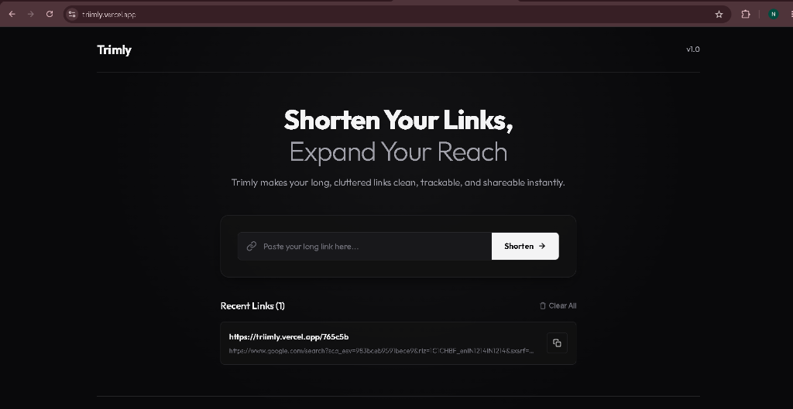
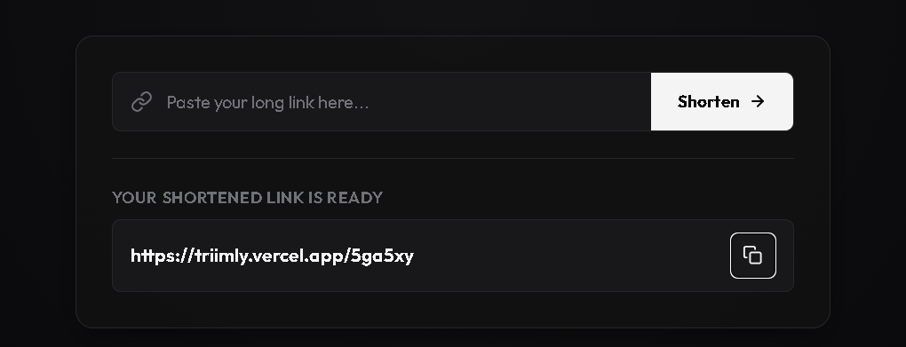

# Trimly — Premium & Secure URL Shortener

**Trimly** is a high-end, minimalist URL shortening dashboard featuring a modern monochrome theme, auto-protocol correction, copy-to-clipboard interactions, local history tracking, and graceful redirect screens. Built for speed, search optimization, and visual excellence.

---

## Interface Previews

### Dashboard View


### Shortened Link Generation


---

## Key Features

- **Minimalist Monochrome UI:** Designed with a professional dark theme using deep carbon/obsidian backgrounds, sharp contrast solid borders, and clean layout sizing.
- **Auto-Protocol Corrections:** Validates URL strings on submission and automatically prepends `http://` if only a raw domain host is entered.
- **Copy-to-Clipboard Micro-interactions:** Immediate visual confirmation (button changes colors and turns into a checkmark icon) for 2 seconds upon copying a link.
- **Graceful Redirection Loader:** Fully customized monochrome redirection screen with modern loading animations and automated error fallbacks if a code has expired.
- **Local Session Dashboard:** Stores the 10 most recent links inside client `localStorage` so users can track links across sessions without database authentications.
- **SEO & Preview Optimization:** Pre-configured index rules, description parameters, Open Graph tags, and Twitter Cards to show rich preview cards on social channels.

---

## Technology Stack

### Frontend
- **Framework:** React 19 + Vite
- **Routing:** React Router DOM (v6+)
- **Styling:** Vanilla CSS with custom design variables & Google Font **Outfit**
- **HTTP Client:** Axios (linked to production endpoints)

### Backend
- **Server:** Node.js + Express
- **Database:** MongoDB + Mongoose
- **CORS Configuration:** Standard Express CORS middleware configured for cross-origin client request handling

---

## Project Architecture

```text
├── client/                     # Frontend Application
│   ├── public/                 # Static assets (favicons, screenshots)
│   ├── src/
│   │   ├── api/                # API client configuration
│   │   ├── components/         # Home and Code Router elements
│   │   ├── App.jsx             # Main React Router setup
│   │   ├── index.css           # Monochrome design system
│   │   └── main.jsx            # Entry point
│   ├── vercel.json             # Vercel SPA route rewrite configuration
│   └── package.json
│
└── server/                     # Backend Application
    ├── models/                 # Mongoose database models
    ├── routes/                 # Express router controllers
    ├── main.js                 # Server entry point
    └── package.json
```

---

## Getting Started

To spin up a local instance of Trimly, follow these steps:

### 1. Prerequisites
- [Node.js](https://nodejs.org/) installed
- A running instance of [MongoDB](https://www.mongodb.com/) (local or cloud Atlas URI)

### 2. Backend Setup
1. Navigate to the server folder:
   ```bash
   cd server
   ```
2. Install server dependencies:
   ```bash
   npm install
   ```
3. Create a `.env` file in the `server` root:
   ```env
   MONGO_URI=your_mongodb_connection_string
   ```
4. Start the server:
   ```bash
   npm start
   ```
   The backend should run on port `3000`.

### 3. Frontend Setup
1. Open a new terminal and navigate to the client folder:
   ```bash
   cd client
   ```
2. Install client dependencies:
   ```bash
   npm install
   ```
3. Start the Vite development server:
   ```bash
   npm run dev
   ```
4. Open the development link (typically `http://localhost:5173`) in your browser.

---

## Deployment Details

- **Frontend:** Deployed on **Vercel** with full client-side routing support (handled via `vercel.json` rewrites).
- **Backend:** Deployed on **Render** (endpoints are wired up inside [api.js](client/src/api/api.js)).

---

<div align="center">
  <p>Built by <strong>Nilesh Kashani</strong></p>
</div>
